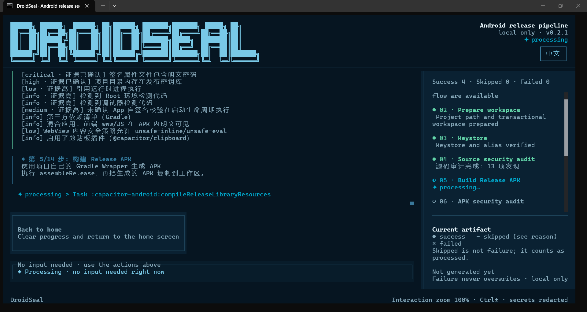

# DroidSeal · 安卓发布封签

[中文](README.zh-CN.md) | [English](README.md)

[](https://github.com/noontiger/droidseal/stargazers)
[](https://github.com/noontiger/droidseal/forks)
[](https://github.com/noontiger/droidseal/issues)
[](https://github.com/noontiger/droidseal/commits/main)

[](https://www.npmjs.com/package/droidseal)
[](https://www.npmjs.com/package/droidseal)
[](https://pypi.org/project/droidseal)
[](https://pypi.org/project/droidseal)
[](https://github.com/noontiger/droidseal/blob/main/LICENSE)

**安卓发布封签**帮你完成商业加固前能做的大多数事——环境诊断、源码与 APK 审计、R8 混淆、zipalign 对齐、apksigner 签名与最终验证，商业加固前，一键端到端。

```bash
$ droidseal
[01] 环境诊断 ............ ok
[02] 准备工作区 .......... ok
[03] 签名库 .............. ok
[04] 源码安全审计 ........ ok
[05] 构建 Release APK .... ok
[06] APK 安全审计 ........ ok
[07] 本地安全防护 ........ ok
[08] Release 归一化 ...... ok
[09] Web JS 发布处理 .... 跳过（可选）
[10] 资源名混淆 ......... 跳过（可选）
[11] ZIP 对齐 ............ ok
[12] APK 签名 ............ ok
[13] 最终验证 ............ ok
[14] 生成报告 ............ ok
› 最终 APK 与审计报告已生成
```

## 能做什么

- **审计**：项目与 APK 静态审计——权限、targetSdk、签名方案、硬编码密钥、DEX/TLS 启发式、Native so 加固、第三方依赖与 CycloneDX SBOM；
- **发布**：按官方顺序执行 `zipalign → apksigner 签名 → 验证`，失败自动回退，每步独立制品；
- **产物**：APK + SHA-256 + JSON/Markdown 报告 + 发布门禁 + SBOM。



## 安装

| 渠道 | 方式 |
|---|---|
| npm | `npm install --global droidseal` |
| PyPI | `pip install droidseal` |
| GitHub Releases | 直接下载 Windows zip / Linux tar.gz |

> **Windows 提示**：双击 exe 被 SmartScreen 拦截时，右键 → 属性 → 解除锁定。TUI 需在终端中运行：PowerShell 执行 `droidseal`，或双击随包附带的 `droidseal-gui.cmd` 启动器。

## 使用

```powershell
droidseal              # 交互式 TUI 向导（一键 / 分步）
droidseal doctor       # 非交互环境诊断
droidseal --version
```

## 平台与状态

- **平台**：Windows x64 / Linux x64；
- **状态**：1.0.0 正式版——CLI、输出目录与报告格式现已稳定。

## 安全边界

防御性工具：默认不脱壳、不加壳、不注入 Hook / 反调试代码；完全本地运行，不上传 APK、路径或签名信息。

## 许可与品牌

- 开源许可：[Apache License 2.0](https://github.com/noontiger/droidseal/blob/main/LICENSE)
- 名称与 Logo 使用：[TRADEMARKS.md](https://github.com/noontiger/droidseal/blob/main/TRADEMARKS.md)（评测、教程、分享注明来源即可）
- 第三方声明：[THIRD_PARTY_NOTICES.md](https://github.com/noontiger/droidseal/blob/main/THIRD_PARTY_NOTICES.md)


